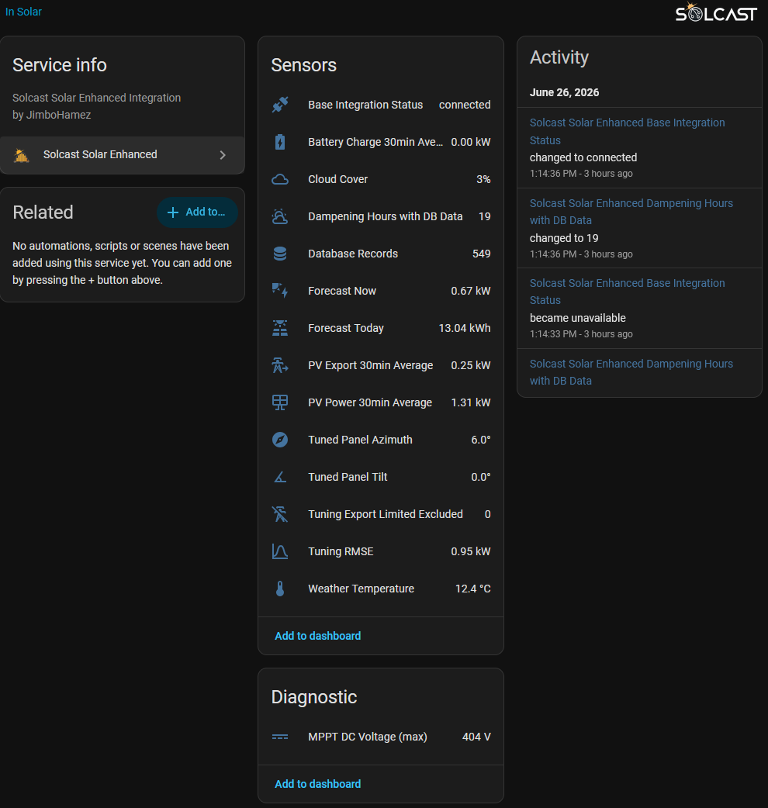
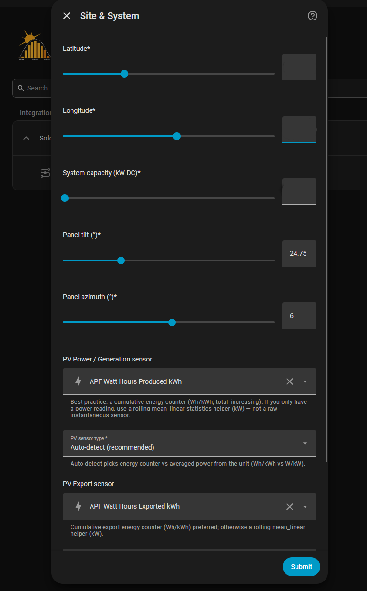
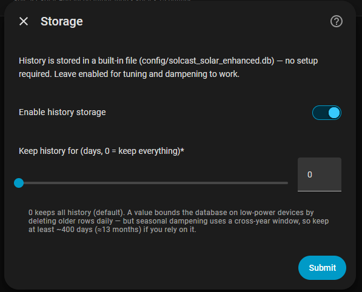
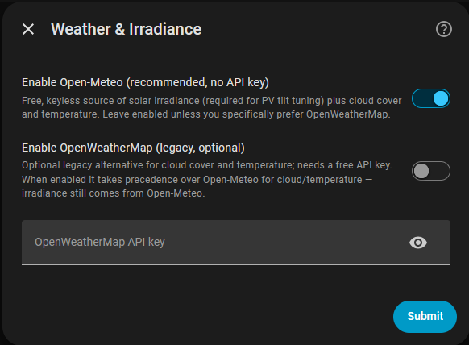
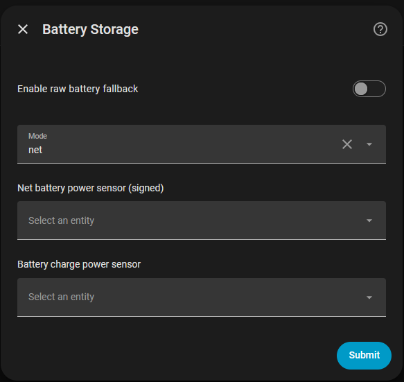
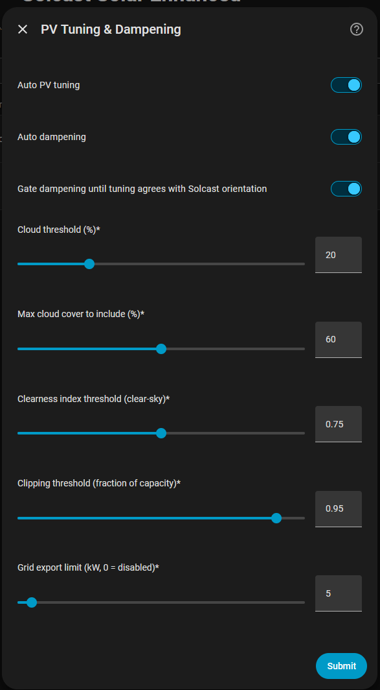
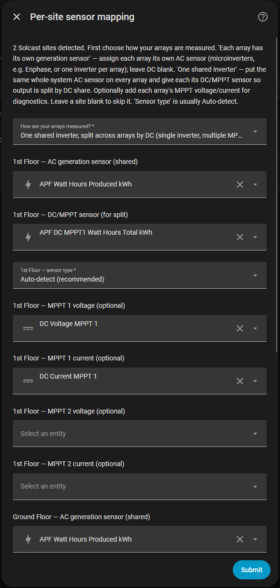

# Solcast Solar Enhanced

[](https://github.com/hacs/integration)

[](https://github.com/JimboHamez/ha_solcast_solar_enhanced/releases/latest)


[](https://github.com/JimboHamez/ha_solcast_solar_enhanced/actions/workflows/test.yml)
[](https://github.com/JimboHamez/ha_solcast_solar_enhanced/actions/workflows/validate.yml)
[](https://github.com/JimboHamez/ha_solcast_solar_enhanced/actions/workflows/security.yml)

A companion to [BJReplay/ha-solcast-solar](https://github.com/BJReplay/ha-solcast-solar) that learns from your own generation history to make your Solcast forecasts more accurate — automatically, and entirely on your device.

It adds:

- **History storage** — keeps your PV, forecast, weather and battery data in a built-in SQLite file. No server, no setup.
- **Automatic panel tuning** — works out your real panel tilt and azimuth from generation data and corrects the forecast geometry.
- **Adaptive dampening** — learns where your forecast runs high or low (shading, local conditions) and pushes a correction back to Solcast. Starts neutral and gets stronger as it gathers data.
- **Multi-site** — handles multiple rooftop arrays on one property, discovered automatically.
- **Flexible inputs** — reads energy counters (recommended) or power sensors, with auto-detection.
- **Curtailment-aware** — knows when your inverter is export-limited so curtailed output isn't mistaken for shading.

**No extra Solcast API calls** — it reads forecast data straight from the base integration.

---

## Why this exists

Solcast [discontinued PV Tuning for free accounts](https://kb.solcast.com.au/pv-tuning-discontinued), so home users can no longer feed their real generation back to Solcast to sharpen forecasts.

This integration brings that back, on your own hardware. It records your actual-vs-forecast history locally and computes its own tuning and dampening — and because it also folds in local cloud cover, per-array geometry and export-limit handling, the result can be *better* than the old service, not just a replacement.

---

## 🆕 What's new in v1.10.0b7 (beta)

**One bad Solcast forecast can no longer cancel out an hour of shading.** Your base integration polls Solcast about nine times a day, and occasionally a poll re-forecasts the afternoon as cloudy when it stays clear — the forecast drops to ~1 kW while your array happily makes 3–4 kW. That single record used to enter the shading average as a ratio of 4.0, dragging the whole hour above 1.0. Since dampening can only *reduce* a forecast, never boost it, the result got clamped to "no dampening at all" — throwing away the real shading every other record had measured. Nine honest records saying 20% shading, plus one bad poll, produced **zero** dampening.

The shading ratio is now an **energy-weighted aggregate** rather than an average of per-slot ratios, so each record counts in proportion to how much energy it actually represents. A slot forecast at 0.2 kW can no longer shout as loudly as a slot forecast at 4 kW ([issue #52](https://github.com/JimboHamez/ha_solcast_solar_enhanced/issues/52)). Nothing to configure. On real data this recovers shading that was previously being discarded — on one array, an hour that had been reading "no shading needed" actually warranted around 25%.

> **v1.10.0b6 — shading dampening no longer measures your output against its own corrections.** The shading factor is the ratio of measured output to forecast — but the forecast it read back from the base integration had *already* been dampened by the factors this companion pushed. So each cycle compared your array against a forecast it had itself lowered, and the ratio drifted toward "no shading". The maths settles at the **square root** of the true ratio: an array genuinely making 50% of forecast would converge to a 0.71 factor instead of 0.50, while looking perfectly converged. The ratio is now anchored to the base's **pre-dampening** forecast, so shading is measured against a figure this integration never touched ([issue #50](https://github.com/JimboHamez/ha_solcast_solar_enhanced/issues/50)).

> The effect is small today (measured at ~0.5% on a real install) because it scales with dampening confidence — it would have grown to roughly **20 percentage points of shading never applied** as confidence matured. Nothing to configure. The corrected figure is stored per slot going forward; the base only retains ~28 days of pre-dampening history, so existing rows keep using the old denominator and are gradually replaced. The **Shading** sensor gains an `undampened_records` attribute showing how many records have the clean denominator yet.

> **v1.10.0b5 — forecast retrieval now works on non-English Home Assistant installs.** The base `solcast_solar` integration names its sensors via translation, so on a non-English HA the forecast-today entity id is localized — and the companion's hard-coded English lookup found nothing, zeroing every forecast column (so `pv_estimate` read 0 and per-site dampening/tuning was starved). The base sensor is now located by its untranslated `detailedForecast` attribute rather than its name, so it's found in any language ([issue #41](https://github.com/JimboHamez/ha_solcast_solar_enhanced/issues/41)). English installs are unaffected. This release also hardens the codebase with strict type-checking enforced in CI (no behaviour change).

> **v1.10.0b4 — per-array cards gain Azimuth + Tuning RMSE, and the multi-site main card is de-cluttered.** Each array's own card now also shows its **Azimuth** (the orientation configured in Solcast, held fixed and never tuned) and a diagnostic **Tuning RMSE** (that array's fit error in kW — the trust signal for its tuned tilt). In a multi-site setup the property-wide **Tuned Panel Tilt / Azimuth / Tuning RMSE** sensors are now hidden on the main card by default, since the aggregate blends differently-oriented arrays and the meaningful values live per-array. New sensors also use localized entity names (all 11 shipped locales). Single-site installs are unchanged.

> **v1.10.0b3 — per-site dampening now uses your base integration's real per-site forecast, even across differently-oriented arrays.** The base `solcast_solar` integration publishes each site's forecast under a `detailedForecast_<resource_id>` attribute (with the resource_id's hyphens written as underscores); the companion wasn't matching that exact key, so it silently fell back to splitting the *property* forecast by capacity share — which is only valid when arrays share an orientation. It now reads the true per-site forecast where the base exposes it, so per-site shading dampening engages correctly **regardless of array azimuth**. (Installs where the base genuinely exposes no per-site detail are unaffected and keep the capacity-share fallback.)

> **v1.10.0b2 — multi-site dashboards get tidier: each array is its own Home Assistant device.** Instead of one device piling 20-plus entities onto a single card, every configured array gets **its own device and card** (nested under the main integration). Each array's card now carries these entities:

- **PV Power 30min Average** — that array's measured generation for the period (DC-share apportioned for shared-inverter setups).
- **Shading** — its measured daytime dampening factor (orientation, shading %, confidence and clear-sky basis in attributes).
- **Tuned Tilt** — its optimised tilt, promoted from an attribute to a first-class sensor (fit quality + configured tilt in attributes).
- **Azimuth** *(new in b4)* — its orientation as configured in Solcast (held fixed, never tuned), shown alongside the tuned tilt.
- **Tuning RMSE** *(new in b4, diagnostic)* — that array's tuning fit error (kW); the trust signal for its tuned tilt (lower = tighter fit). In the device's Diagnostic section.

In a multi-site setup the property-wide **Tuned Panel Tilt / Azimuth / Tuning RMSE** sensors are hidden on the main card by default — the aggregate blends differently-oriented arrays, so the meaningful values now live on each array's own card. (Single-site installs are unchanged: there the aggregate *is* the one site, so those stay on the main card.)

So you can see ground vs upper output, shading and tuning side by side, per array. Name each array on the sites step — it defaults to your Solcast site name.

**Upgrading?** Drop-in. On reload, your existing `… Shading` entities keep their IDs but **move** onto each array's new device, and the PV Power / Tuned Tilt sensors appear alongside them. No config change or migration.

> Also in this beta line (**v1.10.0b1**): adaptive dampening now finds clear-sky periods from **measured irradiance** (clearness index `Kt = GHI / clear-sky GHI`, Open-Meteo, on by default) instead of the biased model cloud field — governed by the existing **Clearness index threshold** option, with a new `clear_sky_basis` attribute; the **PV Forecast Confidence** load-scheduling sensor (0–100, high/medium/low — a decision aid, never a forecast); **per-site shading dampening now actually engages** (the property forecast is split across same-orientation arrays by capacity share when no per-site forecast exists); and Open-Meteo irradiance is recorded as a true **half-hour mean**. Earlier (v1.9.x): config-wizard screenshots, the topology selector, and microinverter setups not needing a whole-system sensor.

Full history in the [CHANGELOG](CHANGELOG.md) · [release notes](https://github.com/JimboHamez/ha_solcast_solar_enhanced/releases).

---

## Prerequisites

### 1. Base integration

[BJReplay/ha-solcast-solar](https://github.com/BJReplay/ha-solcast-solar) must be installed and configured first. It's a hard dependency — Home Assistant won't set this up without it. You can only add this integration **once** (one property, one database).

### 2. Generation / export sensors

Point the integration at your inverter's sensors. Two kinds work:

- **Best — an energy counter** (`Wh`/`kWh`/`MWh`, e.g. your lifetime or daily generation total, and your grid-export total). The integration works out average power from how much the counter moved over each interval. Exact, and no helper needed.
- **Fallback — a rolling power helper** (`W`/`kW`). If you can't expose an energy counter, wrap your power sensor in a `mean_linear` statistics helper (below).

> ⚠️ **Don't use a raw instantaneous power sensor.** A single spot reading isn't the half-hour average and will skew the results. Use an energy counter, or the helper below.

You map these in the setup wizard (Step 1). Battery is optional; multi-site arrays are mapped in Step 6.

<details>
<summary>Rolling mean_linear power helper (only if you have no energy counter)</summary>

A continuous sliding-window sensor that never resets at the half-hour mark:

```yaml
sensor:
  - platform: statistics
    name: "PV Power 30min Rolling Mean"
    entity_id: sensor.YOUR_INVERTER_AC_POWER_SENSOR
    state_characteristic: mean_linear   # time-weighted mean (not plain "mean")
    max_age:
      minutes: 30
    sampling_size: 1800                  # raise it so samples aren't dropped
```

(Repeat for export and per-MPPT DC as needed.)
</details>

### 3. History storage

Powers dampening and tuning, and needs nothing — a built-in SQLite file (`config/solcast_solar_enhanced.db`) is created automatically. On by default.

### 4. Weather & irradiance (Open-Meteo — keyless, on by default)

Tuning and dampening only learn from *clear-sky* periods (cloudy ones tell you nothing about your panels), and PV tilt tuning additionally needs solar **irradiance**. Both now come from [**Open-Meteo**](https://open-meteo.com/), which is **free and needs no API key** — it's enabled by default, so there's nothing to set up. It supplies the irradiance components (GHI/DNI/DHI) plus cloud cover and temperature.

> **OpenWeatherMap is now optional (legacy).** If you'd rather use OWM for cloud/temperature, enable it in setup **Step 3** and paste a free key — it then takes precedence for cloud/temperature, while irradiance still comes from Open-Meteo. A repair issue appears only if you disable Open-Meteo *and* don't configure OWM, leaving no weather source at all.

**Check it's working** after setup: the **Cloud Cover** sensor should show a real percentage and the repair issue (if any) should be gone. To make tuning useful on day one rather than waiting for fresh data, backfill irradiance onto your existing history with `tools/backfill_irradiance.py` (see [Standalone tools](#standalone-tools)).

---

## Installation

<p align="center">
  <a href="images/dashboard.png"></a>
</p>

### HACS (recommended)

1. Add this repository as a custom repository in HACS.
2. Install **Solcast Solar Enhanced**.
3. Restart Home Assistant.

### Manual

1. Copy `custom_components/solcast_solar_enhanced` into your HA `config/custom_components/` directory.
2. Restart Home Assistant.

Storage uses the Python standard library, so there's nothing to install. PV tuning uses **numpy**, which Home Assistant already ships (and which runs on a Raspberry Pi) — so a normal HA install needs nothing extra.

---

## Configuration

Go to **Settings → Devices & Services → Add Integration → Solcast Solar Enhanced**.

The wizard has 5 steps (a 6th, **Per-site sensor mapping**, appears only when more than one Solcast site is detected).

### Step 1 — Site & System

<p align="center">
  <a href="images/config-step1-site.png"></a>
</p>

| Field | Description |
|---|---|
| Latitude / Longitude | Your site coordinates |
| System capacity (kW DC) | Total panel DC capacity |
| Panel tilt | 0° = flat, 90° = vertical |
| Panel azimuth | Solcast convention — 0° = North, **positive = West**, **negative = East**. E.g. +6 = 6° West of North |
| PV Generation sensor | Energy counter (recommended) or a rolling power helper |
| PV sensor type | `Auto-detect` (default), `Energy counter`, or `Averaged power` |
| PV Export sensor | Export energy counter (recommended) or a rolling helper |
| PV Export sensor type | As above, for export |
| Battery Charge sensor | Battery charge sensor (optional) |
| MPPT 1/2 DC voltage + current | Optional — your inverter's per-string voltage/current sensors, for curtailment-detection capture. Leave MPPT 2 blank for single-tracker inverters. **Single-array systems only** — these fields are hidden for multi-array systems, which map per-array MPPT in Step 6 instead |

### Step 2 — Storage

<p align="center">
  <a href="images/config-step2-storage.png"></a>
</p>

| Field | Default | Description |
|---|---|---|
| Enable history storage | On | Toggle the built-in store on/off |
| Keep history for (days) | 0 | `0` keeps everything. A positive value prunes older rows daily to save space. Seasonal dampening works best with ≥ ~400 days |

The store lives at `config/solcast_solar_enhanced.db`. To browse it, point the [sqlite-web add-on](https://github.com/hassio-addons/addon-sqlite-web) at that path.

### Step 3 — Weather & Irradiance

<p align="center">
  <a href="images/config-step3-weather.png"></a>
</p>

Open-Meteo (keyless) is on by default and powers tuning & dampening (see [§4 above](#4-weather--irradiance-open-meteo--keyless-on-by-default)). OpenWeatherMap is an optional legacy alternative for cloud/temperature.

| Field | Default | Description |
|---|---|---|
| Enable Open-Meteo | **On** | Keyless irradiance (GHI/DNI/DHI) + cloud/temperature |
| Enable OWM | **Off** | Optional legacy cloud/temperature source; needs a key |
| OWM API key | — | Free key from openweathermap.org (only if OWM enabled) |

### Step 4 — Battery Storage

<p align="center">
  <a href="images/config-step4-battery.png"></a>
</p>

A fallback for systems without a battery sensor mapped in Step 1.

| Field | Description |
|---|---|
| Enable raw battery fallback | Toggle |
| Mode | `net` (signed power sensor) or `separate` (charge-only sensor) |
| Net battery sensor | Signed power entity (positive = charging) |
| Charge battery sensor | Charge-only power entity |

### Step 5 — PV Tuning & Dampening

<p align="center">
  <a href="images/config-step5-tuning.png"></a>
</p>

| Field | Default | Description |
|---|---|---|
| Auto PV tuning | On | Run tilt/azimuth optimisation daily |
| Auto dampening | On | Recalculate and push dampening every 6 hours |
| Cloud threshold % | 20 | OWM-cloud clear-sky gate: records below this count as clear-sky (used only when Open-Meteo is off) |
| Max cloud % to include | 60 | Records above this are excluded |
| Clearness index threshold | 0.75 | Clear-sky gate when Open-Meteo is on (the default): a half-hour counts as clear when `Kt = GHI ÷ clear-sky GHI` is at or above this. More reliable than total cloud %, which over-rejects clear slots with harmless high/mid cloud |
| Clipping threshold | 0.95 | Fraction of capacity at which clipping is assumed |
| Grid export limit (kW) | 0 | Exclude records pegged at this ceiling; 0 = disabled. Read automatically from the base integration if set |

### Step 6 — Per-site sensor mapping (multi-site only)

<a href="images/config-step6-sites.png"></a>

Shown when more than one Solcast site is detected. Sites are auto-discovered from the base integration (orientation and capacity come from Solcast). For each site you map its generation sensor, and optionally its per-string DC sensors.

This page appears only for multi-array systems — a single-array system relies on the system-wide sensors from Step 1 and never sees it. It opens by asking **how your arrays are measured**, then shows only the fields that topology needs:

- **Each array has its own generation sensor** (microinverters, e.g. Enphase, or one inverter per array): map each array's own AC/generation sensor; there's no DC field. The per-site **generation sensor** is pre-filled with Step 1's system-wide PV Generation sensor — pick the array's own sensor when arrays are separately metered.
- **One shared inverter, split by DC** (a single multi-string inverter, e.g. Fronius): put the *same* whole-system AC sensor on every array and give each its **DC/MPPT sensor**, so the shared AC is split between arrays by DC share. Leaving a DC sensor off an array, or using different AC sensors, is flagged with an error rather than silently dropped.
- The per-site **MPPT voltage/current** fields are the per-array home for MPPT trackers (diagnostics). For multi-array systems they live *here only* — Step 1 hides its MPPT fields. If you're upgrading from an older version that had MPPT entities on Step 1, they're suggested on the first two arrays here for you to confirm (and cleared from Step 1 on save).

See [Multi-site](#multi-site) for how shared inverters are split between arrays.

> **Heads up:** the base integration's own **automatic dampening** must be **disabled** (Solcast PV Forecast → Configure). While it's on, the base rejects manual dampening, so this integration can't apply its factors — it detects this, skips the push, and logs a warning.

---

<br clear="all">

## How it works

- **PV tuning** runs daily: it searches for the panel tilt and azimuth that best explain your clear-sky generation, and reports them on the **Tuned Panel Tilt/Azimuth** sensors. Needs at least ~10 clear-sky, non-clipped records. Clear-sky half-hours are selected by a measured **clearness index** (`Kt = GHI ÷ clear-sky GHI`) when Open-Meteo is on — avoiding total cloud %'s habit of rejecting genuinely clear slots that had harmless high/mid cloud (in cloudy winters that gate can reject *every* clear record, starving the optimiser).
- **Adaptive dampening** compares your actual output to the forecast across a ±14-day seasonal window, weighting each record by how clear the sky was and how close the sun was to the same position. It starts at a neutral no-op and ramps toward the measured correction as data builds, then pushes 24 hourly factors to Solcast via `set_dampening`. The base integration's own dampening factors are never read into this — the correction is learned purely from your history.
- **Curtailment** — when your inverter is export-limited, that capped output is detected and handled so it doesn't look like shading: tuning excludes it, and dampening clips it to the achievable ceiling so a curtailed clear day stays neutral.

Full detail — the confidence model, the weighting maths, convergence timelines by climate, and design decisions — lives in the [design document](DESIGN_DOCUMENT.md).

### Multi-site

When the base integration has more than one rooftop array, each is stored, tuned and dampened separately (keyed by its Solcast `resource_id`) alongside the property-wide aggregate. Single-site behaviour is unchanged.

The per-site step asks which of these two topologies you have, then shows only the matching fields:

- **Dedicated AC per array (simplest).** If every array is independently metered — microinverters (e.g. Enphase) or one string inverter per array — map each site's own AC/generation sensor. There's no DC field in this mode; each site reports its own AC directly, no apportionment needed.
- **Shared inverter AC.** If several arrays share one AC sensor (a single multi-string inverter, e.g. Fronius), put that same AC sensor on every array and give each its per-string DC sensor; the integration splits the measured AC between them by each string's share of DC current (`ac × dcᵢ / Σ dc`), so each array can still be tuned individually. Every array in this mode needs a DC sensor and they must share one AC sensor — otherwise the wizard shows an error rather than silently dropping an array.

---

## Sensors

| Sensor | Unit | Description |
|---|---|---|
| Forecast Now | kW | Current 30-min PV forecast (from base integration) |
| Forecast Today | kWh | Total forecast for today (from base integration) |
| Tuned Panel Tilt | ° | Optimised tilt from PV tuning (carries `mae_kw`, `capacity_scale`, and a `per_site` attribute in multi-site mode) |
| Tuned Panel Azimuth | ° | Your configured azimuth — **not tuned** (azimuth is non-identifiable from this data; `azimuth_tuned: false`). Reported for reference only |
| Tuning RMSE | kW | Goodness of fit for the tuned tilt |
| Tuning Export Limited Excluded | — | Records dropped from the last tuning run by the export-limit filter |
| Database Records | — | Total records in the store |
| MPPT DC Voltage (max) | V | Diagnostic — highest captured string voltage this cycle (per-tracker detail in attributes). Unavailable until per-string DC sensors are configured |
| Dampening Hours with DB Data | — | Hours where DB-derived factors are active (per-hour diagnostics in attributes) |
| Weather Temperature | °C | Current temperature (Open-Meteo, or OWM if configured) |
| Cloud Cover | % | Cloud cover (Open-Meteo, or OWM if configured) |
| Battery Charge 30min Average | kW | From the configured battery sensor (restored across restarts) |
| PV Power 30min Average | kW | Average generation for the period (restored across restarts) |
| PV Export 30min Average | kW | Average export for the period (restored across restarts) |
| PV Forecast Confidence | 0–100 | Short-horizon load-scheduling decision aid — how well recent output is tracking the forecast (`rating` high/medium/low + `recent_bias` in attributes). A decision aid, not a forecast; never pushed to the base |
| Base Integration Status | — | `connected` or `not_detected` |

### Per-site sensors (multi-site only)

When you configure more than one array, each array gets **its own HA device** (grouped on its own card, nested under the main integration device), carrying these entities:

| Sensor | Unit | Description |
|---|---|---|
| `<array>` PV Power 30min Average | kW | That array's measured generation for the period (DC-share apportioned for shared-inverter setups; `pv_estimate` + `capacity_kw` in attributes) |
| `<array>` Shading | — | Average daytime dampening factor (1.0 = no shading, < 1 = measured structural shading), with orientation, `shading_pct`, confidence and clear-sky basis in attributes |
| `<array>` Tuned Tilt | ° | Optimised tilt from that array's last PV tuning run (fit RMSE, record count and configured tilt/orientation in attributes) |

Each array's display name comes from the **sites** config step (defaults to its Solcast site name).

---

## Services

| Service | Description |
|---|---|
| `solcast_solar_enhanced.run_pv_tuning` | Force immediate PV tuning |
| `solcast_solar_enhanced.run_dampening_update` | Force immediate dampening recalculation and push |
| `solcast_solar_enhanced.fetch_weather` | Force immediate weather fetch (Open-Meteo / OWM) |

---

## Standalone tools

`tools/standalone_tuning.py` runs the same tilt optimisation outside Home Assistant, against the SQLite store or a CSV export — handy for experimenting without waiting for the daily run.

```bash
# Whole-property tuning from the built-in store
python tools/standalone_tuning.py --sqlite config/solcast_solar_enhanced.db --capacity 6.6

# One site, seeded with that array's orientation
python tools/standalone_tuning.py --sqlite config/solcast_solar_enhanced.db \
    --site b68d-c05a --capacity 5 --tilt 30 --azimuth 67.5

# Every site in the table
python tools/standalone_tuning.py --sqlite config/solcast_solar_enhanced.db --all-sites
```

Requires `numpy`. Run `--help` for all options.

### Backfill irradiance

`tools/backfill_irradiance.py` fills the `ghi`/`dni`/`dhi` columns on existing rows from Open-Meteo's free historical archive, so transposition-based tilt tuning is useful immediately instead of waiting months for fresh data to accumulate. Stdlib-only; safe to re-run (fills only rows still missing irradiance).

```bash
python tools/backfill_irradiance.py --sqlite config/solcast_solar_enhanced.db \
    --lat -37.9046 --lon 145.0362
```

---

## Roadmap

- **Curtailment detector (DC-telemetry).** Tells real curtailment apart from shading on the DC side. Phase 1 (dampening clip-forecast) and Phase 2 (per-string DC capture + diagnostic sensor) are done; a self-calibrating per-string voltage model is next as telemetry accumulates.
- **Emergency-backstop and variable export limits** — recognising market-operator and dynamic DNSP curtailment so those intervals aren't mistaken for shading.

See the [design document](DESIGN_DOCUMENT.md#roadmap) for the full plan and the database schema.

---

## Compatibility

| Component | Version |
|---|---|
| Home Assistant | 2026.5.4+ |
| Python | 3.12+ |
| Storage | stdlib `sqlite3` — no install |
| numpy | PV tuning — 1.21.0+ (ships with Home Assistant) |

---

## License

Apache-2.0 — see [LICENSE](LICENSE).
