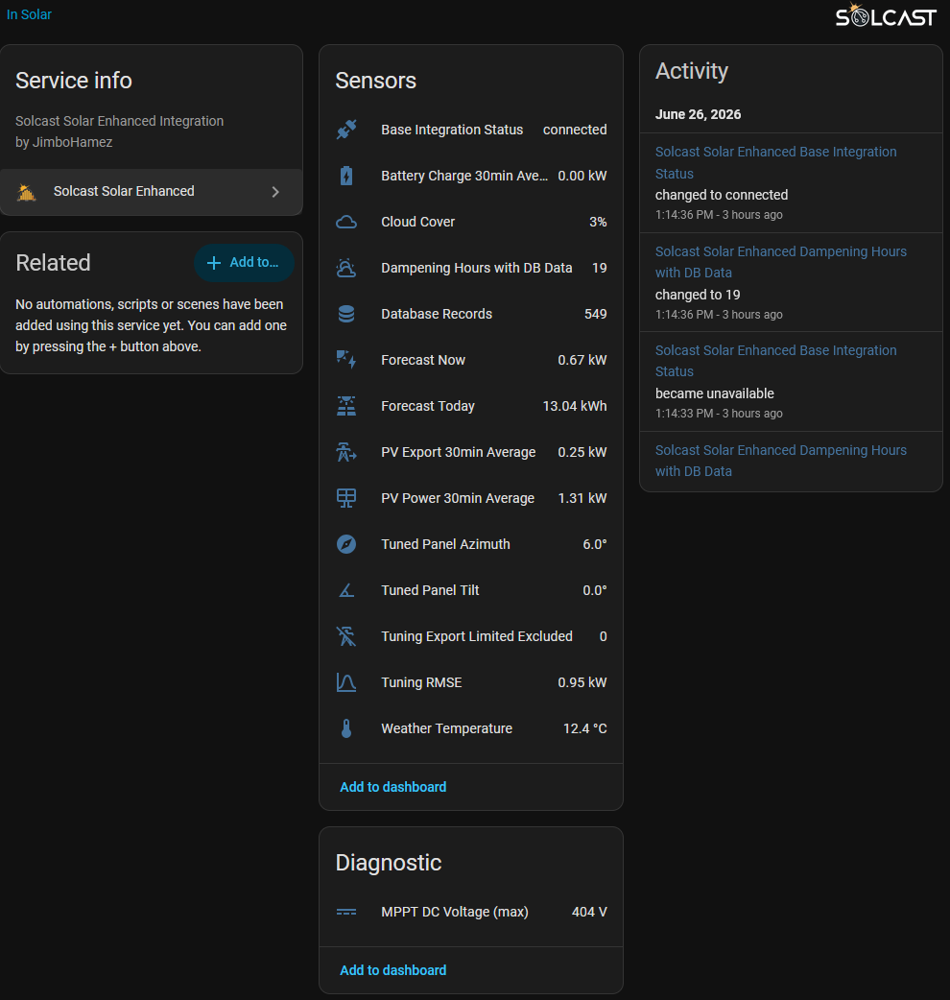
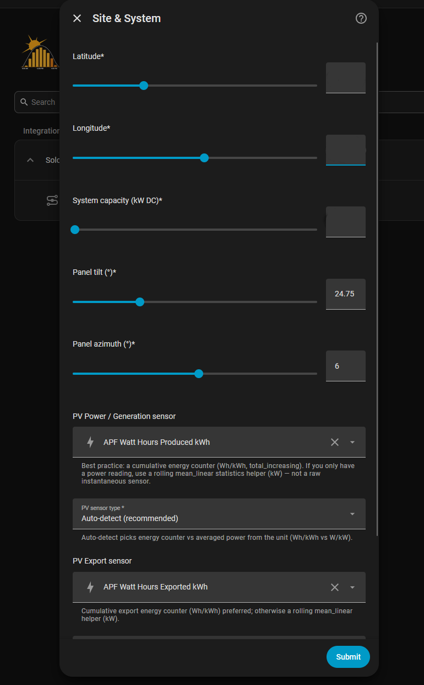
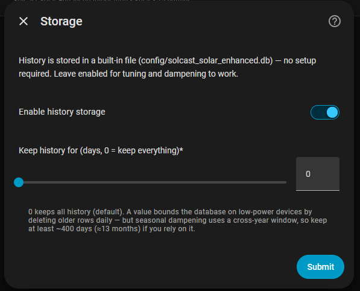
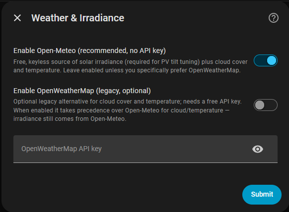
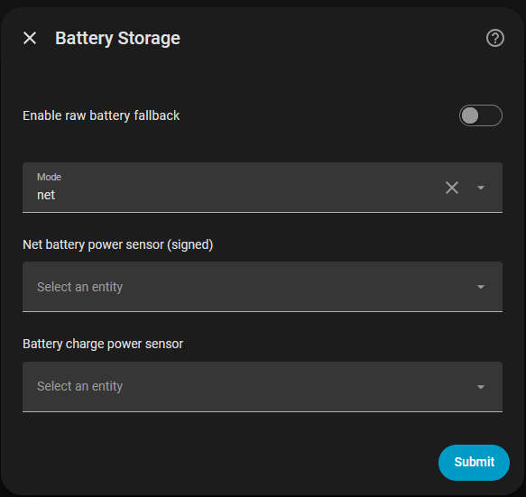
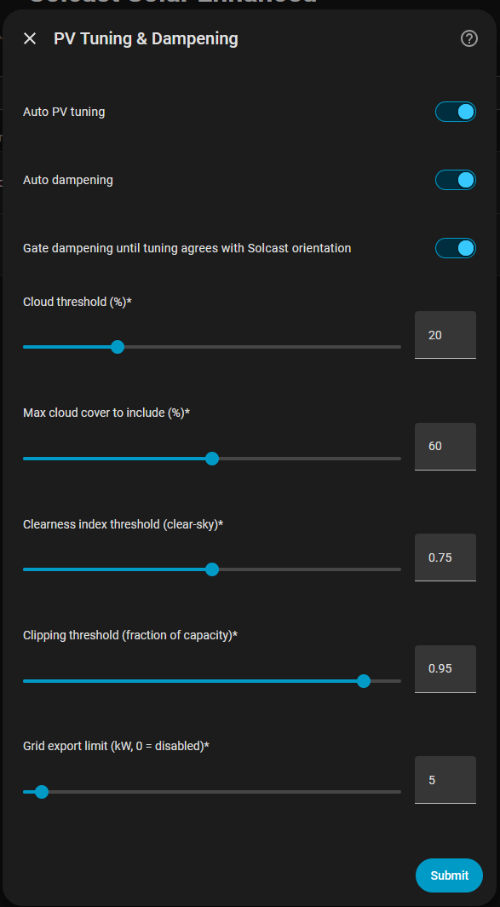
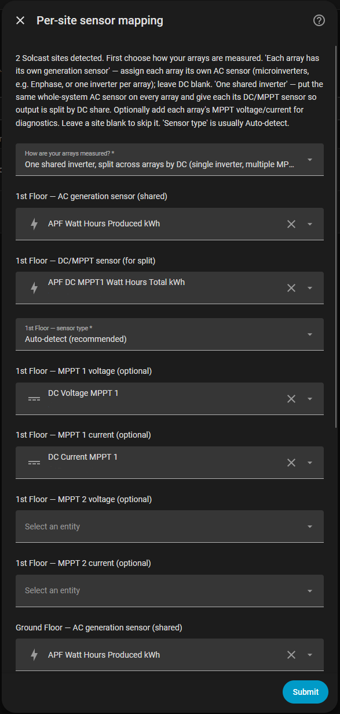

# Solcast Solar Enhanced

[](https://github.com/hacs/integration)

[](https://github.com/JimboHamez/ha_solcast_solar_enhanced/releases/latest)


[](#home-assistant-quality-scale)

[](https://github.com/JimboHamez/ha_solcast_solar_enhanced/actions/workflows/test.yml)
[](https://github.com/JimboHamez/ha_solcast_solar_enhanced/actions/workflows/validate.yml)
[](https://github.com/JimboHamez/ha_solcast_solar_enhanced/actions/workflows/security.yml)

An adaptive forecasting layer that uses the telemetry available from your PV system to identify and compensate for site-specific differences between modelled and actual generation.

A companion to [BJReplay/ha-solcast-solar](https://github.com/BJReplay/ha-solcast-solar): it learns from your own generation history to make your Solcast forecasts more accurate — automatically, and entirely on your device.

It adds:

- **History storage** — keeps your PV, forecast, weather and battery data in a built-in SQLite file. No server, no setup.
- **Automatic panel tuning** — works out your real panel tilt and azimuth from generation data and corrects the forecast geometry.
- **Adaptive dampening** — learns where your forecast runs high or low (shading, local conditions) and pushes a correction back to Solcast. Starts neutral and gets stronger as it gathers data.
- **Multi-site** — handles multiple rooftop arrays on one property, discovered automatically.
- **Flexible inputs** — reads energy counters (recommended) or power sensors, with auto-detection.
- **Curtailment-aware** — knows when your inverter is export-limited so curtailed output isn't mistaken for shading.

**No extra Solcast API calls** — it reads forecast data straight from the base integration.

---

## Why this exists

Solcast [discontinued PV Tuning for free accounts](https://kb.solcast.com.au/pv-tuning-discontinued), so home users can no longer feed their real generation back to Solcast to sharpen forecasts.

This integration brings that back, on your own hardware. It records your actual-vs-forecast history locally and computes its own tuning and dampening — and because it also folds in local cloud cover, per-array geometry and export-limit handling, the result can be *better* than the old service, not just a replacement.

---

## 🆕 What's new in v1.10.2

**Patch: *Base Integration Status* read `not_detected` on Solcast PV Forecast 4.6.0 and 4.6.1.** The base integration stopped publishing itself to the place we looked, so a perfectly healthy install was reported as missing. ([#64](https://github.com/JimboHamez/ha_solcast_solar_enhanced/issues/64) — thanks to **@frankie-boy-hgv** for the report and **@chess-m** for tracking down the cause and testing a fix.)

**The sensor was the only thing affected** — history collection, tuning and dampening all read the base integration by other paths and kept working throughout, which is why the database kept growing while the sensor said otherwise.

We now detect the base by its config entry rather than by an internal dictionary it no longer uses, so the check survives that kind of change. It's also honest in the other direction: if the base integration is installed but its entry has genuinely failed to load, the sensor says `not_detected` instead of being fooled by the placeholder actions the base leaves registered when it isn't running.

<details>
<summary><b>What landed in v1.10.1</b></summary>

**Patch: the inverter-clipping filter never fired.** If your inverter clips at midday — very common on a DC-oversized array — those saturated records were staying in the dataset with both measured output and forecast pinned at the ceiling, which pulls the shading ratio toward 1.0 in the most valuable hours of the day. Exactly what the filter exists to prevent.

Three things were wrong, all one root cause. The **System capacity** field was labelled *"kW DC"* while its only job is an **AC** threshold, so following the label set the ceiling 10–35% out of reach. Solcast's own site data settles it — `capacity` is the inverter nameplate (AC) rating, `capacity_dc` the panel rating — so capacity is now **read from Solcast automatically**, with the field relabelled and kept as a fallback. And per-array dampening was clipping at the *whole property's* capacity, which killed the filter per-array even on systems with no DC oversizing at all.

If your stored value still looks like a DC figure, you'll get a repair notice naming both numbers. **Expect your dampening curve to change around midday** — that's the filter working for the first time. ([#59](https://github.com/JimboHamez/ha_solcast_solar_enhanced/issues/59))

</details>

<details>
<summary><b>What landed in v1.10.0</b></summary>

**The big one is dampening accuracy: two separate bugs were quietly throwing away the shading this integration had correctly measured.** Both are fixed, and both were confirmed against live generation data rather than argued from theory. If you have an array with real shading, this release is the one where the correction starts landing at its true size.

- **Shading was being measured against the integration's own corrections** ([issue #50](https://github.com/JimboHamez/ha_solcast_solar_enhanced/issues/50)). The forecast it compared your output against had already been dampened by the factors it pushed last cycle — so each round it marked its own homework and drifted toward "no shading here". The maths settles on the **square root** of the true ratio: an array genuinely making 50% of forecast parks at a 0.71 factor instead of 0.50, while looking perfectly converged. Measured on a live dual-array install on 31 July, the contaminated comparison overstated the shaded array's performance by **7.25%**, and would have left roughly **20 percentage points of real shading permanently unapplied** once confidence matured. The ratio is now anchored to the base integration's pre-dampening forecast.
- **One bad Solcast poll could cancel a whole hour of shading** ([issue #52](https://github.com/JimboHamez/ha_solcast_solar_enhanced/issues/52)). Your base integration polls Solcast about nine times a day, and now and then a poll re-forecasts a clear afternoon as cloudy — forecast drops to ~1 kW while your array cheerfully makes 3–4 kW. That single record entered the average as a ratio of 4.0 and dragged the hour above 1.0; since dampening can only *reduce* a forecast, the result was clamped to **zero dampening**, discarding what every honest record had measured.
- **Clear-sky days are now identified by measured irradiance**, not the weather model's cloud field — which runs biased high and false-overcasts precisely the clear days a shading measurement depends on.
- **The tuner now says "I don't know" instead of guessing.** Roof tilt turns out to be nearly indistinguishable from a change in fitted capacity, so on real arrays the "best" tilt is often decided by noise — one live install wandered between 7.8° and 30° across ten days against a configured 24.75°. **Tuned Tilt** now reports no value when the fit can't support one, with the reason in its attributes.
- **Every array is its own device**, with its own card carrying PV Power, Shading, Tuned Tilt, Azimuth, Tuning RMSE and a **Current Hour Dampening** sensor showing the exact factor in effect right now.
- **Non-English Home Assistant installs get their forecast data at all** ([issue #41](https://github.com/JimboHamez/ha_solcast_solar_enhanced/issues/41)) — the English-only lookup used to find nothing and zero every forecast column.

**Upgrading from 1.9.x?** Drop-in. Your existing entities keep their IDs. One caveat: the undampened forecast can't be backfilled (the base integration only keeps ~28 days of it), so your existing history keeps using the old comparison and ages out over a fortnight.

</details>

<details>
<summary><b>Also in the 1.10.0 line — quality-scale housekeeping (Gold)</b></summary>

Nothing here changes how your forecast gets corrected. This brings the integration in line with Home Assistant's [Integration Quality Scale](https://developers.home-assistant.io/docs/core/integration-quality-scale/checklist), clearing every applicable **Bronze, Silver and Gold** rule.

Ten things you'll actually notice:

- **You can download diagnostics.** **⋮ → Download diagnostics** on the integration page now produces one file with the effective configuration, the last collector readings, the full half-hour dampening curve, the tuning fit and the store's coverage. Previously, answering "why is it doing that?" meant screenshotting a dozen entity attributes. Your OpenWeatherMap key and your site coordinates are redacted, so it's safe to attach to an issue.
- **There's now a Reconfigure option.** The full setup wizard can be re-run against your existing entry from the integration's menu, prefilled with what you have configured today. The options flow already covered the same ground; Reconfigure is what Home Assistant's UI now steers people to, and it writes both halves of the config so a value you enter can't be shadowed by an older options value.
- **Devices for arrays you stop measuring are cleaned up.** Removing an array in the sites step used to leave an empty device card behind that you couldn't get rid of. It's now removed on reload, and any array device we no longer own can be deleted by hand from its device page.
- **The README gained Examples, Troubleshooting and Known limitations sections** — ready-to-paste automations, a symptom-to-cause table for the things that actually go wrong (dampening that appears to do nothing, a Tuned Tilt reading *unknown*, per-site sensors sitting at zero), and a plain list of what this integration cannot do and why.

- **Every sensor name is now translated.** Fourteen sensors — Forecast Now/Today, Tuned Panel Tilt/Azimuth, Tuning RMSE, Database Records, MPPT DC Voltage, Dampening Hours with DB Data, Weather Temperature, Cloud Cover, the three 30-min averages and Base Integration Status — were still English-only in all 11 shipped locales, while the rest of the sensors were translated. They now follow your Home Assistant language like everything else.
- **Your OpenWeatherMap key is tested before it's saved.** Enabling OWM in the setup wizard now probes the API with the key you typed. A rejected key, an unreachable service or a blank key each stop you on the step with a specific message, instead of being accepted and then failing quietly on every fetch afterwards. (A brand-new OpenWeatherMap key can take a couple of hours to activate, so it may legitimately be rejected at first.) Open-Meteo is keyless and the database is a local file, so neither needs testing.
- **The three actions now tell you when they can't run — and when they didn't work.** `run_pv_tuning`, `run_dampening_update` and `fetch_weather` previously did nothing at all — silently — if the integration wasn't loaded, and a failure *inside* one was written to the log and otherwise swallowed, so the action reported success. Both now raise an error you can see. They're also registered at Home Assistant startup rather than when the integration loads, so automations that reference them keep validating even while it's disabled.
- **`fetch_weather` now actually refreshes Open-Meteo.** It only ever refreshed OpenWeatherMap — so on a default install, where Open-Meteo is the keyless source and OWM isn't configured, calling it did nothing whatsoever and still reported success. It now refreshes whichever sources you have enabled, and tells you if you've enabled none.
- **Sensors that have lost their data source now read *unavailable* rather than sitting blank.** *Weather Temperature* and *Cloud Cover* when no weather source is enabled or a fetch comes back empty; *MPPT DC Voltage* when no per-string DC sensors are configured. A blank value can't be told apart from a genuine zero at a glance — *unavailable* can. See [the note in the quality-scale section](#where-entities-read-unavailable-vs-unknown) for where this deliberately does *not* apply.
- **The README documents how to remove the integration** — including the two things deliberately left behind, and why: your history database (so reinstalling resumes instead of restarting the multi-week data build) and any dampening factors already pushed to Solcast.

> **One caveat, if you run Home Assistant in a language other than English.** Translated entity names mean Home Assistant builds entity IDs from the *translated* name. That only applies to entities being registered for the first time, so upgrading changes nothing — but a **fresh** install in a non-English language will get localized entity IDs rather than the English ones listed in the Sensors table below. Check the IDs in the UI before writing automations against them. This is the same mechanism behind the issue #41 fix, and it's inherent to naming entities the way Home Assistant asks.

</details>

<details>
<summary><b>How the 1.10.0 line got here — the ten betas, newest first</b></summary>

> **v1.10.0b9 — PV tuning now says "I don't know" instead of guessing your roof tilt.** The tuner searches for the tilt that best explains your clear-sky generation, but on many real roofs that search has no meaningful answer and it was reporting one anyway. Changing tilt turns out to be almost the same as changing the fitted capacity scale (only ~1–2% different across the whole plausible range), which the fit cancels out — so once your data is noisier than that, and real winter arrays are by a long way, the "best" tilt is decided by whichever records happened to arrive rather than by your roof. On one real install the tuned tilt wandered between 7.8° and 30° across ten days against a configured 24.75°, then drifted down to 2°. Not one of those numbers meant anything.

> The tuner now checks whether the answer is actually supported by the data, and the **Tuned Tilt** sensors report no value when it isn't — with the reason and the fit error in the attributes, plus the value it would have reported. (The b9 notes described this as *unavailable*; the state is in fact *unknown*, deliberately, because Home Assistant hides the attributes of an unavailable entity and the attributes are the whole point here.) The **orientation warning** added in b8 is silenced in that case too: it exists to tell you your Solcast tilt looks wrong, and it shouldn't say that on the strength of a number we know is noise. If your fit *is* good, nothing changes. **Honest limitation:** this catches "can't tell", not "confidently wrong" — an array with heavy morning shading can produce a tight fit at a badly wrong tilt, and that still gets through. Treat a reported tilt as a hint and check the Tuning RMSE before acting on it.

> **v1.10.0b8 — you can now watch the dampening factor that's actually in effect right now.** Until now the only way to see what dampening was being applied was to dig through the per-hour attributes on the *Dampening Hours with DB Data* sensor, and per-array there was nothing at all beyond a whole-day average. This beta adds a **Current Hour Dampening** sensor — property-wide, plus one per array — carrying the exact factor pushed to Solcast for the current local hour. Because it's a sensor state rather than an attribute it gets recorder history, so you can graph the dampening curve against your measured output over the day.

> These are **disabled by default**: they're a development and diagnostic aid, not something a normal install needs. Enable them from the integration's entity list if you want them. One thing worth knowing when reading one: a factor near `1.0` only means "no shading measured" when the `alpha` attribute is high. At low alpha it means "not enough records yet", and the state alone can't tell you which.

> **Also in b8: the orientation check no longer switches dampening off.** If PV tuning settled on a tilt that disagreed with your Solcast site by more than 15°, this integration used to hold that array's dampening flat at `1.0` until you fixed it. That turned out to be the wrong trade. The check's trigger is the tuned tilt — and tilt is often barely identifiable from real data, because changing it is only ~1–2% different from changing the fitted capacity scale, which the fit cancels out. On a real winter install the tuned tilt swung between 7.8° and 30° on noise alone, coming within **0.05°** of tripping the threshold and silently disabling a perfectly good shading correction. Suppressing a sound measurement on the strength of an unsound one is backwards, so the check is now **advisory**: you still get the repair-issue warning that your Solcast tilt may be wrong, but your dampening keeps working. The option is renamed accordingly ("Warn when tuning disagrees with Solcast orientation") and still defaults to on.

> **v1.10.0b7 — one bad Solcast forecast can no longer cancel out an hour of shading.** Your base integration polls Solcast about nine times a day, and occasionally a poll re-forecasts the afternoon as cloudy when it stays clear — the forecast drops to ~1 kW while your array happily makes 3–4 kW. That single record used to enter the shading average as a ratio of 4.0, dragging the whole hour above 1.0. Since dampening can only *reduce* a forecast, never boost it, the result got clamped to "no dampening at all" — throwing away the real shading every other record had measured. Nine honest records saying 20% shading, plus one bad poll, produced **zero** dampening.

> The shading ratio is now an **energy-weighted aggregate** rather than an average of per-slot ratios, so each record counts in proportion to how much energy it actually represents. A slot forecast at 0.2 kW can no longer shout as loudly as a slot forecast at 4 kW ([issue #52](https://github.com/JimboHamez/ha_solcast_solar_enhanced/issues/52)). Nothing to configure. On real data this recovers shading that was previously being discarded — on one array, an hour that had been reading "no shading needed" actually warranted around 25%.

> **v1.10.0b6 — shading dampening no longer measures your output against its own corrections.** The shading factor is the ratio of measured output to forecast — but the forecast it read back from the base integration had *already* been dampened by the factors this companion pushed. So each cycle compared your array against a forecast it had itself lowered, and the ratio drifted toward "no shading". The maths settles at the **square root** of the true ratio: an array genuinely making 50% of forecast would converge to a 0.71 factor instead of 0.50, while looking perfectly converged. The ratio is now anchored to the base's **pre-dampening** forecast, so shading is measured against a figure this integration never touched ([issue #50](https://github.com/JimboHamez/ha_solcast_solar_enhanced/issues/50)).

> The effect is small today (measured at ~0.5% on a real install) because it scales with dampening confidence — it would have grown to roughly **20 percentage points of shading never applied** as confidence matured. Nothing to configure. The corrected figure is stored per slot going forward; the base only retains ~28 days of pre-dampening history, so existing rows keep using the old denominator and are gradually replaced. The **Shading** sensor gains an `undampened_records` attribute showing how many records have the clean denominator yet.

> **v1.10.0b5 — forecast retrieval now works on non-English Home Assistant installs.** The base `solcast_solar` integration names its sensors via translation, so on a non-English HA the forecast-today entity id is localized — and the companion's hard-coded English lookup found nothing, zeroing every forecast column (so `pv_estimate` read 0 and per-site dampening/tuning was starved). The base sensor is now located by its untranslated `detailedForecast` attribute rather than its name, so it's found in any language ([issue #41](https://github.com/JimboHamez/ha_solcast_solar_enhanced/issues/41)). English installs are unaffected. This release also hardens the codebase with strict type-checking enforced in CI (no behaviour change).

> **v1.10.0b4 — per-array cards gain Azimuth + Tuning RMSE, and the multi-site main card is de-cluttered.** Each array's own card now also shows its **Azimuth** (the orientation configured in Solcast, held fixed and never tuned) and a diagnostic **Tuning RMSE** (that array's fit error in kW — the trust signal for its tuned tilt). In a multi-site setup the property-wide **Tuned Panel Tilt / Azimuth / Tuning RMSE** sensors are now hidden on the main card by default, since the aggregate blends differently-oriented arrays and the meaningful values live per-array. New sensors also use localized entity names (all 11 shipped locales). Single-site installs are unchanged.

> **v1.10.0b3 — per-site dampening now uses your base integration's real per-site forecast, even across differently-oriented arrays.** The base `solcast_solar` integration publishes each site's forecast under a `detailedForecast_<resource_id>` attribute (with the resource_id's hyphens written as underscores); the companion wasn't matching that exact key, so it silently fell back to splitting the *property* forecast by capacity share — which is only valid when arrays share an orientation. It now reads the true per-site forecast where the base exposes it, so per-site shading dampening engages correctly **regardless of array azimuth**. (Installs where the base genuinely exposes no per-site detail are unaffected and keep the capacity-share fallback.)

> **v1.10.0b2 — multi-site dashboards get tidier: each array is its own Home Assistant device.** Instead of one device piling 20-plus entities onto a single card, every configured array gets **its own device and card** (nested under the main integration). Each array's card now carries these entities:

- **PV Power 30min Average** — that array's measured generation for the period (DC-share apportioned for shared-inverter setups).
- **Shading** — its measured daytime dampening factor (orientation, shading %, confidence and clear-sky basis in attributes).
- **Tuned Tilt** — its optimised tilt, promoted from an attribute to a first-class sensor (fit quality + configured tilt in attributes).
- **Azimuth** *(new in b4)* — its orientation as configured in Solcast (held fixed, never tuned), shown alongside the tuned tilt.
- **Tuning RMSE** *(new in b4, diagnostic)* — that array's tuning fit error (kW); the trust signal for its tuned tilt (lower = tighter fit). In the device's Diagnostic section.

In a multi-site setup the property-wide **Tuned Panel Tilt / Azimuth / Tuning RMSE** sensors are hidden on the main card by default — the aggregate blends differently-oriented arrays, so the meaningful values now live on each array's own card. (Single-site installs are unchanged: there the aggregate *is* the one site, so those stay on the main card.)

So you can see ground vs upper output, shading and tuning side by side, per array. Name each array on the sites step — it defaults to your Solcast site name.

**Upgrading?** Drop-in. On reload, your existing `… Shading` entities keep their IDs but **move** onto each array's new device, and the PV Power / Tuned Tilt sensors appear alongside them. No config change or migration.

> Also in this beta line (**v1.10.0b1**): adaptive dampening now finds clear-sky periods from **measured irradiance** (clearness index `Kt = GHI / clear-sky GHI`, Open-Meteo, on by default) instead of the biased model cloud field — governed by the existing **Clearness index threshold** option, with a new `clear_sky_basis` attribute; the **PV Forecast Confidence** load-scheduling sensor (0–100, high/medium/low — a decision aid, never a forecast); **per-site shading dampening now actually engages** (the property forecast is split across same-orientation arrays by capacity share when no per-site forecast exists); and Open-Meteo irradiance is recorded as a true **half-hour mean**. Earlier (v1.9.x): config-wizard screenshots, the topology selector, and microinverter setups not needing a whole-system sensor.

</details>

Full history in the [CHANGELOG](CHANGELOG.md) · [release notes](https://github.com/JimboHamez/ha_solcast_solar_enhanced/releases).

---

## Prerequisites

### 1. Base integration

[BJReplay/ha-solcast-solar](https://github.com/BJReplay/ha-solcast-solar) must be installed and configured first. It's a hard dependency — Home Assistant won't set this up without it. You can only add this integration **once** (one property, one database).

### 2. Generation / export sensors

Point the integration at your inverter's sensors. Two kinds work:

- **Best — an energy counter** (`Wh`/`kWh`/`MWh`, e.g. your lifetime or daily generation total, and your grid-export total). The integration works out average power from how much the counter moved over each interval. Exact, and no helper needed.
- **Fallback — a rolling power helper** (`W`/`kW`). If you can't expose an energy counter, wrap your power sensor in a `mean_linear` statistics helper (below).

> ⚠️ **Don't use a raw instantaneous power sensor.** A single spot reading isn't the half-hour average and will skew the results. Use an energy counter, or the helper below.

You map these in the setup wizard (Step 1). Battery is optional; multi-site arrays are mapped in Step 6.

<details>
<summary>Rolling mean_linear power helper (only if you have no energy counter)</summary>

A continuous sliding-window sensor that never resets at the half-hour mark:

```yaml
sensor:
  - platform: statistics
    name: "PV Power 30min Rolling Mean"
    entity_id: sensor.YOUR_INVERTER_AC_POWER_SENSOR
    state_characteristic: mean_linear   # time-weighted mean (not plain "mean")
    max_age:
      minutes: 30
    sampling_size: 1800                  # raise it so samples aren't dropped
```

(Repeat for export and per-MPPT DC as needed.)
</details>

### 3. History storage

Powers dampening and tuning, and needs nothing — a built-in SQLite file (`config/solcast_solar_enhanced.db`) is created automatically. On by default.

### 4. Weather & irradiance (Open-Meteo — keyless, on by default)

Tuning and dampening only learn from *clear-sky* periods (cloudy ones tell you nothing about your panels), and PV tilt tuning additionally needs solar **irradiance**. Both now come from [**Open-Meteo**](https://open-meteo.com/), which is **free and needs no API key** — it's enabled by default, so there's nothing to set up. It supplies the irradiance components (GHI/DNI/DHI) plus cloud cover and temperature.

> **OpenWeatherMap is now optional (legacy).** If you'd rather use OWM for cloud/temperature, enable it in setup **Step 3** and paste a free key — it then takes precedence for cloud/temperature, while irradiance still comes from Open-Meteo. A repair issue appears only if you disable Open-Meteo *and* don't configure OWM, leaving no weather source at all.

**Check it's working** after setup: the **Cloud Cover** sensor should show a real percentage and the repair issue (if any) should be gone. To make tuning useful on day one rather than waiting for fresh data, backfill irradiance onto your existing history with `tools/backfill_irradiance.py` (see [Standalone tools](#standalone-tools)).

---

## Installation

<p align="center">
  <a href="images/dashboard.png"></a>
</p>

### HACS (recommended)

1. Add this repository as a custom repository in HACS.
2. Install **Solcast Solar Enhanced**.
3. Restart Home Assistant.

### Manual

1. Copy `custom_components/solcast_solar_enhanced` into your HA `config/custom_components/` directory.
2. Restart Home Assistant.

Storage uses the Python standard library, so there's nothing to install. PV tuning uses **numpy**, which Home Assistant already ships (and which runs on a Raspberry Pi) — so a normal HA install needs nothing extra.

### Removing the integration

1. Go to **Settings → Devices & Services**, find **Solcast Solar Enhanced**, open the ⋮ menu on the entry and choose **Delete**. This removes the config entry along with every device and entity it created.
2. If you installed via HACS, open HACS → **Solcast Solar Enhanced** → ⋮ → **Remove**. For a manual install, delete `config/custom_components/solcast_solar_enhanced/`.
3. Restart Home Assistant.

Two things are deliberately left behind, because deleting them is not reversible:

- **The history database.** `config/solcast_solar_enhanced.db` (plus any `-wal`/`-shm` files beside it) holds every actual-vs-forecast record ever collected. Deleting the integration leaves it in place, so reinstalling picks up where you left off. Delete the file yourself if you want the history gone — from scratch, the dampening blend needs weeks of records before it carries real weight again.
- **Dampening factors already pushed to the base integration.** Removing this integration stops future pushes but does not undo the last one, so the Solcast PV Forecast integration keeps applying whatever factors it was last given. To clear them, either clear **granular dampening** in the Solcast PV Forecast options (which deletes `solcast-dampening.json`), or call `solcast_solar.set_dampening` with 24 factors of `1.0` and no site. Leaving them in place is harmless but means your forecast stays shaded by the last measured curve.

---

## Configuration

Go to **Settings → Devices & Services → Add Integration → Solcast Solar Enhanced**.

The wizard has 5 steps (a 6th, **Per-site sensor mapping**, appears only when more than one Solcast site is detected).

### Step 1 — Site & System

<p align="center">
  <a href="images/config-step1-site.png"></a>
</p>

| Field | Description |
|---|---|
| Latitude / Longitude | Your site coordinates |
| System capacity (kW AC — inverter rating) | Your inverter's AC nameplate rating, **not** the panel DC total. Used only as the clipping ceiling: readings at or above `capacity × clipping threshold` are treated as inverter clipping and excluded from tuning and shading. Read from Solcast automatically when your sites report it; this field is the fallback |
| Panel tilt | 0° = flat, 90° = vertical |
| Panel azimuth | Solcast convention — 0° = North, **positive = West**, **negative = East**. E.g. +6 = 6° West of North |
| PV Generation sensor | Energy counter (recommended) or a rolling power helper |
| PV sensor type | `Auto-detect` (default), `Energy counter`, or `Averaged power` |
| PV Export sensor | Export energy counter (recommended) or a rolling helper |
| PV Export sensor type | As above, for export |
| Battery Charge sensor | Battery charge sensor (optional) |
| MPPT 1/2 DC voltage + current | Optional — your inverter's per-string voltage/current sensors, for curtailment-detection capture. Leave MPPT 2 blank for single-tracker inverters. **Single-array systems only** — these fields are hidden for multi-array systems, which map per-array MPPT in Step 6 instead |

### Step 2 — Storage

<p align="center">
  <a href="images/config-step2-storage.png"></a>
</p>

| Field | Default | Description |
|---|---|---|
| Enable history storage | On | Toggle the built-in store on/off |
| Keep history for (days) | 0 | `0` keeps everything. A positive value prunes older rows daily to save space. Seasonal dampening works best with ≥ ~400 days |

The store lives at `config/solcast_solar_enhanced.db`. To browse it, point the [sqlite-web add-on](https://github.com/hassio-addons/addon-sqlite-web) at that path.

### Step 3 — Weather & Irradiance

<p align="center">
  <a href="images/config-step3-weather.png"></a>
</p>

Open-Meteo (keyless) is on by default and powers tuning & dampening (see [§4 above](#4-weather--irradiance-open-meteo--keyless-on-by-default)). OpenWeatherMap is an optional legacy alternative for cloud/temperature.

| Field | Default | Description |
|---|---|---|
| Enable Open-Meteo | **On** | Keyless irradiance (GHI/DNI/DHI) + cloud/temperature |
| Enable OWM | **Off** | Optional legacy cloud/temperature source; needs a key |
| OWM API key | — | Free key from openweathermap.org (only if OWM enabled) |

If you enable OWM, the key is tested against the API before the step is accepted — a rejected key, an unreachable service or a blank key each fail here with a message rather than being stored and failing quietly on every later fetch. Note that a newly created OpenWeatherMap key can take a couple of hours to activate, so a brand-new key may legitimately be rejected at first.

### Step 4 — Battery Storage

<p align="center">
  <a href="images/config-step4-battery.png"></a>
</p>

A fallback for systems without a battery sensor mapped in Step 1.

| Field | Description |
|---|---|
| Enable raw battery fallback | Toggle |
| Mode | `net` (signed power sensor) or `separate` (charge-only sensor) |
| Net battery sensor | Signed power entity (positive = charging) |
| Charge battery sensor | Charge-only power entity |

### Step 5 — PV Tuning & Dampening

<p align="center">
  <a href="images/config-step5-tuning.png"></a>
</p>

| Field | Default | Description |
|---|---|---|
| Auto PV tuning | On | Run tilt/azimuth optimisation daily |
| Auto dampening | On | Recalculate and push dampening every 6 hours |
| Cloud threshold % | 20 | OWM-cloud clear-sky gate: records below this count as clear-sky (used only when Open-Meteo is off) |
| Max cloud % to include | 60 | Records above this are excluded |
| Clearness index threshold | 0.75 | Clear-sky gate when Open-Meteo is on (the default): a half-hour counts as clear when `Kt = GHI ÷ clear-sky GHI` is at or above this. More reliable than total cloud %, which over-rejects clear slots with harmless high/mid cloud |
| Clipping threshold | 0.95 | Fraction of capacity at which clipping is assumed |
| Grid export limit (kW) | 0 | Exclude records pegged at this ceiling; 0 = disabled. Read automatically from the base integration if set |

### Step 6 — Per-site sensor mapping (multi-site only)

<a href="images/config-step6-sites.png"></a>

Shown when more than one Solcast site is detected. Sites are auto-discovered from the base integration (orientation and capacity come from Solcast). For each site you map its generation sensor, and optionally its per-string DC sensors.

This page appears only for multi-array systems — a single-array system relies on the system-wide sensors from Step 1 and never sees it. It opens by asking **how your arrays are measured**, then shows only the fields that topology needs:

- **Each array has its own generation sensor** (microinverters, e.g. Enphase, or one inverter per array): map each array's own AC/generation sensor; there's no DC field. The per-site **generation sensor** is pre-filled with Step 1's system-wide PV Generation sensor — pick the array's own sensor when arrays are separately metered.
- **One shared inverter, split by DC** (a single multi-string inverter, e.g. Fronius): put the *same* whole-system AC sensor on every array and give each its **DC/MPPT sensor**, so the shared AC is split between arrays by DC share. Leaving a DC sensor off an array, or using different AC sensors, is flagged with an error rather than silently dropped.
- The per-site **MPPT voltage/current** fields are the per-array home for MPPT trackers (diagnostics). For multi-array systems they live *here only* — Step 1 hides its MPPT fields. If you're upgrading from an older version that had MPPT entities on Step 1, they're suggested on the first two arrays here for you to confirm (and cleared from Step 1 on save).

See [Multi-site](#multi-site) for how shared inverters are split between arrays.

> **Heads up:** the base integration's own **automatic dampening** must be **disabled** (Solcast PV Forecast → Configure). While it's on, the base rejects manual dampening, so this integration can't apply its factors — it detects this, skips the push, and logs a warning.

---

<br clear="all">

## How it works

- **PV tuning** runs daily: it searches for the panel tilt and azimuth that best explain your clear-sky generation, and reports them on the **Tuned Panel Tilt/Azimuth** sensors. Needs at least ~10 clear-sky, non-clipped records. Clear-sky half-hours are selected by a measured **clearness index** (`Kt = GHI ÷ clear-sky GHI`) when Open-Meteo is on — avoiding total cloud %'s habit of rejecting genuinely clear slots that had harmless high/mid cloud (in cloudy winters that gate can reject *every* clear record, starving the optimiser).
- **Adaptive dampening** compares your actual output to the forecast across a ±14-day seasonal window, weighting each record by how clear the sky was and how close the sun was to the same position. It starts at a neutral no-op and ramps toward the measured correction as data builds, then pushes 24 hourly factors to Solcast via `set_dampening`. The base integration's own dampening factors are never read into this — the correction is learned purely from your history.
- **Curtailment** — when your inverter is export-limited, that capped output is detected and handled so it doesn't look like shading: tuning excludes it, and dampening clips it to the achievable ceiling so a curtailed clear day stays neutral.

Full detail — the confidence model, the weighting maths, convergence timelines by climate, and design decisions — lives in the [design document](DESIGN_DOCUMENT.md).

### About the base integration's "granular dampening" setting

The Solcast PV Forecast integration has a **granular dampening** option (its `site_damp` setting). It decides which set of factors the base applies: with it **off** the base uses its own traditional 24 hourly values from its options; with it **on** the base uses a per-site `solcast-dampening.json` file. In a multi-site setup this integration pushes **per-site** factors, and the base turns granular dampening **on automatically** whenever it receives one. Three consequences worth knowing:

- **You don't need to tick the box, and un-ticking it won't stick.** Clearing it makes the base delete the granular file and fall back to its traditional hourly values — which this integration doesn't maintain in multi-site mode, since it deliberately skips the global push so per-site factors aren't overwritten. Your dampening therefore reverts to whatever those legacy values are (usually all `1.0`), until the next 6-hourly push turns granular back on. If you genuinely want dampening off, disable it here rather than fighting the checkbox.
- **A stale `all` entry overrides everything — this integration now warns you.** If that file contains an `all` key, the base uses it and ignores every per-site entry. This integration only writes per-site keys so it can't create one, but a manual `set_dampening` call with 48 factors and no `site` will — the base assigns those to `all` automatically. Symptom without the warning: per-site factors look correct in the file but have no effect. You'll now get a repair notification instead.
- **Mismatched factor counts would disable dampening entirely — so the push stops.** The base discards the whole file if its sites don't all use the same number of factors. This integration pushes 24, so if some other site in the file holds 48, adding ours would bin the lot and leave *every* site undampened. It detects that, skips the push, and raises a repair notification rather than causing the loss.
- **Sites you haven't configured here get no dampening at all.** Once granular is on, a Solcast site absent from that file receives a flat `1.0` — it does *not* inherit the base's traditional hourly values. So if you add a third array in Solcast, configure it here too, or it'll silently run undampened.

Turning the base's own **automatic dampening** on is a separate matter: it makes the base reject manual `set_dampening` calls outright, so this integration detects that and skips pushing entirely (it logs a warning). Turn the base's auto-dampening off if you want this integration to drive dampening.

### Multi-site

When the base integration has more than one rooftop array, each is stored, tuned and dampened separately (keyed by its Solcast `resource_id`) alongside the property-wide aggregate. Single-site behaviour is unchanged.

The per-site step asks which of these two topologies you have, then shows only the matching fields:

- **Dedicated AC per array (simplest).** If every array is independently metered — microinverters (e.g. Enphase) or one string inverter per array — map each site's own AC/generation sensor. There's no DC field in this mode; each site reports its own AC directly, no apportionment needed.
- **Shared inverter AC.** If several arrays share one AC sensor (a single multi-string inverter, e.g. Fronius), put that same AC sensor on every array and give each its per-string DC sensor; the integration splits the measured AC between them by each string's share of DC current (`ac × dcᵢ / Σ dc`), so each array can still be tuned individually. Every array in this mode needs a DC sensor and they must share one AC sensor — otherwise the wizard shows an error rather than silently dropping an array.

---

## Sensors

| Sensor | Unit | Description |
|---|---|---|
| Forecast Now | kW | Current 30-min PV forecast (from base integration) |
| Forecast Today | kWh | Total forecast for today (from base integration) |
| Tuned Panel Tilt | ° | Optimised tilt from PV tuning (carries `mae_kw`, `capacity_scale`, and a `per_site` attribute in multi-site mode). **Unavailable when the fit cannot determine a tilt** — see `tilt_unidentifiable_reason`, `fit_rel_error` and `unidentified_tilt` in the attributes |
| Tuned Panel Azimuth | ° | Your configured azimuth — **not tuned** (azimuth is non-identifiable from this data; `azimuth_tuned: false`). Reported for reference only |
| Tuning RMSE | kW | Goodness of fit for the tuned tilt |
| Tuning Export Limited Excluded | — | Records dropped from the last tuning run by the export-limit filter |
| Database Records | — | Total records in the store |
| MPPT DC Voltage (max) | V | Diagnostic — highest captured string voltage this cycle (per-tracker detail in attributes). Unavailable until per-string DC sensors are configured |
| Dampening Hours with DB Data | — | Hours where DB-derived factors are active (per-hour diagnostics in attributes) |
| Current Hour Dampening | — | *Diagnostic, disabled by default.* The dampening factor in effect for the current local hour (1.0 = none), with `raw_factor`, `alpha`, `source`, `orientation_diverged` and `pushed` in attributes. A sensor state rather than an attribute, so it graphs over the day |
| Weather Temperature | °C | Current temperature (Open-Meteo, or OWM if configured) |
| Cloud Cover | % | Cloud cover (Open-Meteo, or OWM if configured) |
| Battery Charge 30min Average | kW | From the configured battery sensor (restored across restarts) |
| PV Power 30min Average | kW | Average generation for the period (restored across restarts) |
| PV Export 30min Average | kW | Average export for the period (restored across restarts) |
| PV Forecast Confidence | 0–100 | Short-horizon load-scheduling decision aid — how well recent output is tracking the forecast (`rating` high/medium/low + `recent_bias` in attributes). A decision aid, not a forecast; never pushed to the base |
| Base Integration Status | — | `connected` or `not_detected` |

All sensor names above are **translated into your Home Assistant language** (11 locales ship with the integration); the English names are shown here. Existing entities keep the entity IDs they were registered with, so nothing breaks on upgrade — but note that on a *fresh* install in a non-English language, Home Assistant builds each entity ID from the translated name, so the IDs will not be the English ones listed here. Check the entity IDs in Home Assistant before writing automations against them.

### Per-site sensors (multi-site only)

When you configure more than one array, each array gets **its own HA device** (grouped on its own card, nested under the main integration device), carrying these entities:

| Sensor | Unit | Description |
|---|---|---|
| `<array>` PV Power 30min Average | kW | That array's measured generation for the period (DC-share apportioned for shared-inverter setups; `pv_estimate` + `capacity_kw` in attributes) |
| `<array>` Shading | — | Average daytime dampening factor (1.0 = no shading, < 1 = measured structural shading), with orientation, `shading_pct`, confidence and clear-sky basis in attributes |
| `<array>` Tuned Tilt | ° | Optimised tilt from that array's last PV tuning run (fit RMSE, record count and configured tilt/orientation in attributes). Unavailable when the fit cannot determine a tilt |
| `<array>` Azimuth | ° | That array's orientation as configured in Solcast — held fixed, never tuned |
| `<array>` Tuning RMSE | kW | *Diagnostic.* That array's tuning fit error; the trust signal for its tuned tilt (lower = tighter fit) |
| `<array>` Current Hour Dampening | — | *Diagnostic, disabled by default.* The dampening factor in effect for that array for the current local hour — the per-array counterpart to the property-wide sensor above, so differently-shaded arrays can be watched apart |

Each array's display name comes from the **sites** config step (defaults to its Solcast site name).

---

## Services

| Service | Description |
|---|---|
| `solcast_solar_enhanced.run_pv_tuning` | Force immediate PV tuning |
| `solcast_solar_enhanced.run_dampening_update` | Force immediate dampening recalculation and push |
| `solcast_solar_enhanced.fetch_weather` | Force an immediate refresh of every enabled weather/irradiance source (Open-Meteo, OWM) |

All three take no parameters and act on the configured entry. They stay registered even while the integration is unloaded, so automations that reference them keep validating; calling one in that state raises an error telling you the integration isn't loaded, rather than doing nothing.

They also raise when the work itself fails, rather than logging quietly and reporting success — so an automation step built on one will stop instead of carrying on as though it had run. `fetch_weather` additionally refuses when no weather source is enabled at all, since there would be nothing to fetch.

---

## Examples

> The entity IDs below are the **English** defaults. On a non-English install Home Assistant builds them from the translated names, so check yours under **Developer tools → States** before copying anything.

### Run a heavy load when the forecast is being trusted

*PV Forecast Confidence* scores how well the last few hours of real output tracked the forecast. It is a scheduling aid, not a forecast — high confidence means "today's forecast is behaving", which is when it is safe to commit a dishwasher or a car charge to it.

```yaml
automation:
  - alias: Charge the car on a forecast we can trust
    triggers:
      - trigger: numeric_state
        entity_id: sensor.solcast_solar_enhanced_pv_forecast_confidence
        above: 75
    conditions:
      - condition: numeric_state
        entity_id: sensor.solcast_solar_enhanced_forecast_now
        above: 3.0
    actions:
      - action: switch.turn_on
        target:
          entity_id: switch.ev_charger
```

### Re-tune after you change something physical

Tuning runs itself every 24 h, so this is for when you have just cleaned the panels, cut back a tree, or corrected the tilt in Solcast and do not want to wait a day to see the effect.

```yaml
automation:
  - alias: Re-tune after panel maintenance
    triggers:
      - trigger: state
        entity_id: input_boolean.panels_cleaned
        to: "on"
    actions:
      - action: solcast_solar_enhanced.run_pv_tuning
      - delay: "00:01:00"
      - action: solcast_solar_enhanced.run_dampening_update
```

### See what dampening is actually being applied right now

*Current Hour Dampening* is disabled by default (it is diagnostic) — enable it under the device page first. It reports the factor for the current local hour, which is what the base integration is applying to this hour's forecast.

```yaml
template:
  - sensor:
      - name: Shading loss this hour
        unit_of_measurement: "%"
        state: >
          
          {{ ((1 - f) * 100) | round(1) }}
```

### Get told when the tuned orientation disagrees with Solcast

This also raises a repair issue, so the automation is only worth adding if you want it pushed to your phone. It is **advisory** — dampening is still applied either way.

```yaml
automation:
  - alias: Notify on orientation divergence
    triggers:
      - trigger: state
        entity_id: sensor.solcast_solar_enhanced_dampening_hours_with_db_data
        attribute: orientation_diverged
        to: true
    actions:
      - action: notify.mobile_app
        data:
          message: >
            Tuned orientation no longer matches the Solcast site configuration.
```

### Turn on debug logging

```yaml
logger:
  default: warning
  logs:
    custom_components.solcast_solar_enhanced: debug
```

---

## Troubleshooting

**Start with a diagnostics download.** On the integration page choose **⋮ → Download diagnostics**. It contains the effective configuration, the last collector readings, the full half-hour dampening curve, the tuning fit and the store's coverage — enough to answer most "why is it doing that?" questions without any screenshots. Your OpenWeatherMap key and your site coordinates are redacted; everything else is measurement data, so it is safe to attach to an issue.

| Symptom | Likely cause | What to do |
|---|---|---|
| **Dampening seems to have no effect** | The base integration's *automatic dampening* is on — it rejects manual `set_dampening`, so we skip the push entirely | Turn automatic dampening off in the base integration's options |
| **…still no effect, multi-site** | A pre-existing `all` key in the base's granular dampening file shadows every per-site key | Check the repair issues — we detect this and raise one. Clear the `all` entry (a global `set_dampening` call, or the base's own UI) and our next push will land |
| **Dampening factors are all 1.0** | Not enough history yet. The blend ramps from a neutral 1.0 toward the measured ratio as quality-weighted records accumulate | Check `alpha` and `quality_records` in the *Dampening Hours with DB Data* attributes. In winter, or after a database reset, this legitimately takes weeks |
| **Tuned Tilt reads *unknown*** | By design — the fit could not actually determine a tilt, and reporting one you might apply to Solcast would make your forecast worse | Read `tilt_unidentifiable_reason`, `fit_rel_error` and `unidentified_tilt` in the attributes. `railed` means the best fit sat on a search bound; `fit_too_loose` means the residual was too large relative to output |
| **Per-site sensors read 0 or *unknown*** | The base integration is not exposing per-site forecast detail, and the arrays' azimuths differ by more than 10°, so we will not invent a capacity split | Confirm the base's `detailedForecast-<resource_id>` attribute exists. With divergent orientations, per-site dampening needs real per-site detail |
| **Midday shading looks diluted on a clipping inverter** | The clipping filter is not firing, so saturated midday records stay in the dataset and pull the ratio toward 1.0 in the highest-value hours | Check *System capacity* is your inverter's **AC** rating, not the panel DC total. Before 1.10.1 the field was mislabelled "kW DC"; entering the DC figure on a DC-oversized array puts the ceiling out of reach ([#59](https://github.com/JimboHamez/ha_solcast_solar_enhanced/issues/59)). It is now read from Solcast automatically where available, and a repair issue is raised if your stored value still looks like a DC figure |
| **Database Records is not growing** | Storage disabled, or the base integration is not loaded | Check *Base Integration Status* reads `connected`, and that Storage is enabled in the options |
| **Base Integration Status reads `not_detected` although the base works** | Before 1.10.2 we looked for the base in a place Solcast PV Forecast 4.6.0 stopped using | Update to 1.10.2 ([#64](https://github.com/JimboHamez/ha_solcast_solar_enhanced/issues/64)). The sensor was cosmetic — collection, tuning and dampening were unaffected. If it still reads `not_detected` on 1.10.2+, the base's own config entry really has failed to load; check its status in **Settings → Devices & services** |
| **Weather Temperature / Cloud Cover unavailable** | No weather source is enabled, or the last fetch came back empty | Enable Open-Meteo (keyless) in the Weather step. *Unavailable* here means "no source", not "zero" |
| **MPPT DC Voltage unavailable** | No per-string DC sensors are configured | Optional feature — map them in the sites step if your inverter exposes per-tracker voltage and current |
| **Entity IDs don't match the docs** | On a fresh non-English install, Home Assistant derives entity IDs from the *translated* names | Look the real IDs up in **Developer tools → States** |

---

## Known limitations

Stated plainly, because most of these are consequences of what the data can and cannot support rather than bugs waiting to be fixed:

- **Tilt is frequently not identifiable, and azimuth never is.** Rescaling plane-of-array irradiance from one tilt to another leaves only ~1–2% shape residual across the plausible range, and the least-squares capacity scale absorbs almost all of it — so the best-fit tilt is often set by noise. We detect the two clear failure cases and report *unknown*. What this does **not** catch is a fit that is confidently wrong: a moderate low-sun deficit can bias the tilt down while the fit stays tight. Treat a reported tilt as a hint, not an instruction. Azimuth is not tuned at all — it is degenerate with the irradiance-to-power time offset — so *Tuned Panel Azimuth* only echoes what you configured.
- **Dampening needs clear-sky history, and winter is slow.** The confidence blend `α` is a function of quality-weighted record count, so real, strong morning shading can sit largely suppressed for weeks after a fresh install or a database reset — not because the shading was not measured, but because too few clear records have accumulated to trust it yet.
- **The clear-sky gate is GHI-based.** The clearness index `Kt` uses global horizontal irradiance, which admits beam-poor days — thin high cloud or haze that leaves GHI looking healthy while direct beam is gone. A beam-fraction test is the known fix and is not implemented yet.
- **The shading ratio's clean denominator cannot be backfilled.** The ratio divides by the base's forecast *before* our dampening was applied, which the base only retains for about 28 days. Rows written before that window fall back to the dampened figure, whose ratio is biased toward 1.0. `undampened_records` in the *Dampening* attributes tells you how many records have the clean denominator; it only climbs as new data arrives.
- **Per-site forecasts are sometimes apportioned, not measured.** Many base installs don't populate the per-site `detailedForecast` attribute. We fall back to splitting the property-wide forecast by capacity share, but only when the arrays' azimuths agree within 10° — a per-slot capacity split across divergent orientations would invent timing that isn't there. Arrays that fail that test get no per-site forecast, and so no per-site dampening.
- **Our push and the base's granular dampening are coupled.** Pushing per-site factors switches the base's `site_damp` option on automatically, and un-ticking it is undone by our next 6-hourly push. A global (single-site) push and a per-site push are mutually destructive, so we never emit both for one property.
- **Battery support is not exercised on live hardware.** The battery read paths are covered by the test suite, but the author's system has no home battery, so they have never run against a real one. Treat battery features as the least-proven part of the integration.
- **Seasonal queries do a full table scan.** The day-of-year window is a computed expression with no index behind it. Harmless at the sizes a single property produces; noted in the [design document](DESIGN_DOCUMENT.md#roadmap) alongside the retention plan.
- **One property per Home Assistant instance.** `single_config_entry` is set: there is one base integration, one property and one shared database.

---

## Standalone tools

`tools/standalone_tuning.py` runs the same tilt optimisation outside Home Assistant, against the SQLite store or a CSV export — handy for experimenting without waiting for the daily run.

```bash
# Whole-property tuning from the built-in store
python tools/standalone_tuning.py --sqlite config/solcast_solar_enhanced.db --capacity 6.6

# One site, seeded with that array's orientation
python tools/standalone_tuning.py --sqlite config/solcast_solar_enhanced.db \
    --site b68d-c05a --capacity 5 --tilt 30 --azimuth 67.5

# Every site in the table
python tools/standalone_tuning.py --sqlite config/solcast_solar_enhanced.db --all-sites
```

Requires `numpy`. Run `--help` for all options.

### Backfill irradiance

`tools/backfill_irradiance.py` fills the `ghi`/`dni`/`dhi` columns on existing rows from Open-Meteo's free historical archive, so transposition-based tilt tuning is useful immediately instead of waiting months for fresh data to accumulate. Stdlib-only; safe to re-run (fills only rows still missing irradiance).

```bash
python tools/backfill_irradiance.py --sqlite config/solcast_solar_enhanced.db \
    --lat -37.9046 --lon 145.0362
```

---

## Roadmap

- **Curtailment detector (DC-telemetry).** Tells real curtailment apart from shading on the DC side. Phase 1 (dampening clip-forecast) and Phase 2 (per-string DC capture + diagnostic sensor) are done; a self-calibrating per-string voltage model is next as telemetry accumulates.
- **Emergency-backstop and variable export limits** — recognising market-operator and dynamic DNSP curtailment so those intervals aren't mistaken for shading.

See the [design document](DESIGN_DOCUMENT.md#roadmap) for the full plan and the database schema.

---

## Compatibility

| Component | Version |
|---|---|
| Home Assistant | 2026.5.4+ |
| Python | 3.12+ |
| Storage | stdlib `sqlite3` — no install |
| numpy | PV tuning — 1.21.0+ (ships with Home Assistant) |

---

## Home Assistant quality scale

This integration is measured against Home Assistant's [Integration Quality Scale](https://developers.home-assistant.io/docs/core/integration-quality-scale/checklist) — the checklist core integrations are held to, covering setup, entity naming, documentation, typing and test coverage.

**This is a self-assessment, not an awarded tier.** The quality scale is a programme for integrations that ship inside Home Assistant Core; a custom/HACS integration like this one is not eligible for an official rating, and no tier is declared in `manifest.json`. The badge reports our own audit against the published rules, so you can see what has and hasn't been done rather than take "custom integration" on trust.

**Bronze — all 17 applicable rules pass.** `config_flow.py` carries 100% test coverage, entities are uniquely identified and named through translations, the coordinator lives on `entry.runtime_data`, actions register at startup and raise rather than fail silently, and the connection is tested before setup completes. Three Bronze rules don't apply: `brands` (custom integrations can't be listed in the Home Assistant brands repository), and `docs-triggers` / `docs-conditions` (this integration provides none).

**Silver — all 9 applicable rules pass.** The config entry unloads cleanly, the coordinator logs an outage once rather than every cycle, actions raise a translated error when the work fails instead of logging and returning, entities that have lost their data source report *unavailable*, `PARALLEL_UPDATES` is declared, and test coverage sits at 96% against the required 95%. `reauthentication-flow` doesn't apply: there is no primary credential to re-authenticate — OpenWeatherMap is optional and the integration runs fully without it.

**Gold — all applicable rules pass.** Each array is its own device, a diagnostics download is available from the integration page, the whole wizard can be re-run against an existing entry via **Reconfigure**, devices for arrays you stop measuring are cleaned up (and can be deleted by hand), problems surface as repair issues, entity names and icons come from translations, and the docs carry examples, troubleshooting and a known-limitations list.

One Gold rule doesn't apply. `dynamic-devices` asks that devices discovered after setup be added automatically — but an array here only becomes a device once you tell the integration *which sensor measures it*, which cannot be inferred. A new Solcast rooftop appearing in the base integration therefore can't produce a device on its own; mapping it in the sites step does, and that reloads the entry.

**Platinum — all three rules pass, one of them with an asterisk.** `strict-typing` is met outright: `mypy --strict` is clean across the package and a `py.typed` marker ships with it. `async-dependency` and `inject-websession` are met in substance — the HTTP clients are `aiohttp` with no blocking I/O anywhere, and every call site injects Home Assistant's shared session (`async_get_clientsession(hass)`, in both the coordinator and the config flow's connection test) rather than opening its own.

The asterisk is architectural: those two rules assume the API code lives in a **separate published library** declared in `manifest.json` `requirements`, and here it lives in-component as `solcast_api.py`. That split is deliberate. The rule exists so Home Assistant Core can version a dependency independently of the integration that uses it; this integration ships as one unit through HACS, and the "client" is ~260 lines of two thin read-only wrappers over one OpenWeatherMap endpoint and one Open-Meteo endpoint. Splitting it would buy a second repository, a second release cadence and a version-compatibility surface between them, in exchange for nothing a user would notice.

### Where entities read *unavailable* vs *unknown*

The two are not interchangeable, and the distinction is deliberate:

- **Unavailable** means there is no source to read. *Weather Temperature* and *Cloud Cover* go unavailable when no weather source is enabled or a fetch came back empty; *MPPT DC Voltage* goes unavailable when no per-string DC sensors are configured.
- **Unknown** means the source is fine but the value hasn't been measured yet — a per-array sensor before the first half-hour cycle completes, or a **Tuned Tilt** whose fit couldn't pin the tilt down. Tuned Tilt is deliberately *not* marked unavailable in that case: Home Assistant hides the attributes of an unavailable entity, and those attributes carry the reason and the tilt the fit produced.

---

## License

Apache-2.0 — see [LICENSE](LICENSE).
